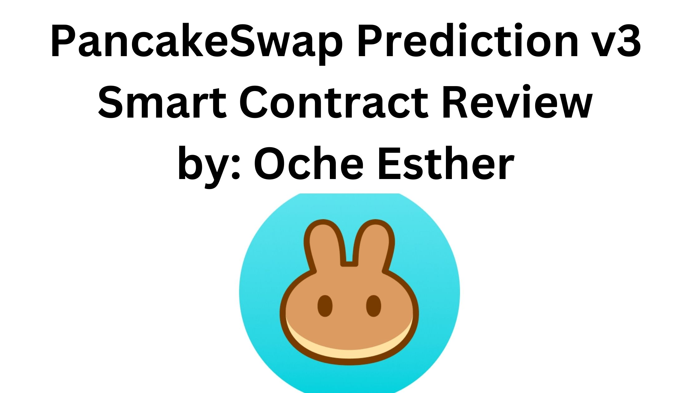

 

# Table of Contents

- [Table of Contents](#table-of-contents)
- [Document Properties](#document-properties)
- [About Me](#about-me)
- [Skills](#skills)
- [Links](#links)
- [Disclaimer](#disclaimer)
- [Abstract](#abstract)
- [1. Introduction](#1-introduction)
  - [1.1 Scope of the Code Review.](#11-scope-of-the-code-review)
  - [1.2 Roles](#12-roles)
  - [1.3   System Overview](#13---system-overview)
- [2. Contract Overview](#2-contract-overview)
  - [2.1 genesisStartRound ():](#21-genesisstartround-)
  - [2.2 genesisLockRound ():](#22-genesislockround-)
  - [2.3 Function betBear():](#23-function-betbear)
  - [2.4 Function betBull():](#24-function-betbull)
  - [2.5 Function Claim():](#25-function-claim)
  - [2.6 executeRound():](#26-executeround)
  - [2.7 pause():](#27-pause)
  - [2.8 claimTreasury():](#28-claimtreasury)
  - [2.9 unpause():](#29-unpause)
  - [2.10 setBufferAndIntervalSeconds():](#210-setbufferandintervalseconds)
  - [2.11 setMinBetAmount():](#211-setminbetamount)
  - [2.12 setOperator():](#212-setoperator)
  - [2.13 setOracle():](#213-setoracle)
  - [2.14 setOracleUpdateAllowance():](#214-setoracleupdateallowance)
  - [2.15 setTreasuryFee():](#215-settreasuryfee)
  - [2.16 recoverToken():](#216-recovertoken)
  - [2.17 setAdmin():](#217-setadmin)
  - [2.19 function getUserRoundsLength():](#219-function-getuserroundslength)
  - [2.20 function claimable():](#220-function-claimable)
  - [2.21 function refundable():](#221-function-refundable)
  - [2.22 \_calculateRewards():](#222-_calculaterewards)
  - [2.23 \_safeEndRound():](#223-_safeendround)
  - [2.24 \_safeLockRound():](#224-_safelockround)
  - [2.25 \_safeStartRound(uint256 epoch):](#225-_safestartrounduint256-epoch)
  - [2.26 \_startRound():](#226-_startround)
  - [2.27 \_bettable():](#227-_bettable)
  - [2.28 \_getPriceFromOracle():](#228-_getpricefromoracle)
  - [2.29 \_isContract(address account):](#229-_iscontractaddress-account)
  - [2.29.1 SUMMARY](#2291-summary)
- [3. Findings](#3-findings)
- [Definition of the Severity in the Smart Contract](#definition-of-the-severity-in-the-smart-contract)
    - [High Severity:](#high-severity)
    - [Medium Severity:](#medium-severity)
    - [Low Severity:](#low-severity)
    - [Informational Severity:](#informational-severity)
  - [3.1 Qualitative Analysis](#31-qualitative-analysis)
- [Key Findings](#key-findings)
- [Others](#others)
    - [7. Integer Overflow and Underflow:](#7-integer-overflow-and-underflow)
    - [8. Access Control:](#8-access-control)
    - [9. Unchecked External Calls:](#9-unchecked-external-calls)
    - [10. Potential Reentrancy in Token Recovery:](#10-potential-reentrancy-in-token-recovery)
    - [11. Timestamp Dependence:](#11-timestamp-dependence)
    - [12. Transaction Ordering Dependence (Front-Running):](#12-transaction-ordering-dependence-front-running)
    - [13. Gas Limit Dependence:](#13-gas-limit-dependence)
    - [14. Denial of Service (DoS) Attacks:](#14-denial-of-service-dos-attacks)
- [4. DETAILED RESULT](#4-detailed-result)
  - [4.1 Missing address (0) check in the constructor](#41-missing-address-0-check-in-the-constructor)
  - [Description](#description)
  - [Recommendation](#recommendation)
  - [4.2 Function claim() External: - call to transfer tokens, Check for reentrancy issues and it reverts without a specific pointer](#42-function-claim-external---call-to-transfer-tokens-check-for-reentrancy-issues-and-it-reverts-without-a-specific-pointer)
  - [Description](#description-1)
  - [Recommendation](#recommendation-1)
  - [4.3 BetBull/ BetBear Epoch errors could be more specific, also has loops or computations that could potentially exceed gas limits.](#43-betbull-betbear-epoch-errors-could-be-more-specific-also-has-loops-or-computations-that-could-potentially-exceed-gas-limits)
  - [Description](#description-2)
  - [Recommendation](#recommendation-2)
  - [4.4 Redundant State/ code removal in BetBear/BetBull](#44-redundant-state-code-removal-in-betbearbetbull)
  - [Description](#description-3)
  - [Recommendation](#recommendation-3)
  - [4.5 Redundant State/ code removal in Claim() function](#45-redundant-state-code-removal-in-claim-function)
  - [Description](#description-4)
  - [Recomendation](#recomendation)
  - [Description](#description-5)
  - [Recommendation](#recommendation-4)
- [5.0 CONCLUSION](#50-conclusion)

# Document Properties

*Table 1: Basic information about PancakeSwap V3*
| Serial Number |     Client     |                  PancakeSwap |
| ------------- | :------------: | ---------------------------: |
| 1             |     Tittle     |    PancakeSwap Prediction V3 |
| 2             |    Version     |                          1.0 |
| 3             | Classification |                       Public |
| 4             |    Language    |                     Solidity |
| 5             |  Audit Method  |                    White-Box |
| 6             |      Type      |          EVM  Smart Contract |
| 7             |    Website     | https://pancakeswap.finance/ |

| Version | Date               | Author      |
| ------- | ------------------ | ----------- |
| 1.0     | `17 October, 2023` | Oche Esther |

# About Me
My name is Oche Esther and I am a Smart Contract Developer. Currently, I'm interning at Web3bridge where I am working to expand my knowledge and skills in the field of blockchain development.

As a developer, I am passionate about creating secure and efficient smart contracts that can help revolutionize the way we interact with technology. I am constantly learning and exploring new technologies.

# Skills

Solidity, Diamond Standard Implemetation, Foundry, Hardhat, Ethers.Js Library, TypeScript, HTML, CSS.

# Links 

LinkedIn: https://www.linkedin.com/in/esther-oche-1792a8168/

Twitter: https://twitter.com/Estheroche1

Email: estheraladioche569@gmail.com

 # Disclaimer
 The smart contract audit I carried out is based on the information provided to me from the PancakeSwap Prediction V3 and my expertise in the field. It is not a guarantee of the security or functionality of the smart contract, and it does not eliminate all potential risks. Cryptocurrency investments come with inherent risks, and I am not liable for any financial losses that may occur as a result of investing in a smart contract or any other cryptocurrency-related activities. Investors are advised to do their own research and due diligence before making any investment decisions.

 #          Abstract
 *This study examined the functions and vulnerabilities in the PancakeSwapPredictionV3.sol. This study used White-Box security Audit Approach to analyse the code base. PancakeSwap is the leading decentralized exchange on Binance Smart Chain, with very high trading volumes in the market. The PancakeSwap Prediction V3 protocol is one of the core functions of PancakeSwap, which is designed as a decentralized BNB price prediction V3 protocol enriches the PancakeSwap ecosystem and also presents a unique contribution to current DeFi ecosystem. There is a privileged account the may post a threat to the protocol. The privilege assignment to such account maybe neccessary and consistent with the protocol design. However, it is worrisome if the privileged account is not governed by a Dao-like structure. Note that a compromised account would allow attacker to modify a number of sensitive system parameters, which directly undermines the assumption of the PancakeSwap Prediction V3 design. Several recommendations was provided such as having a multi-sig for the account and also other coding practices*

 
 # 1. Introduction 
 The "Pancake Prediction V3" smart contract is a decentralized application (dApp) written in Solidity, designed to facilitate a prediction game where users can place bets on the future price movements of a specified asset. The contract leverages Chainlink's oracle network to obtain real-time price data for determining the outcomes of prediction rounds. The main functionalities of the contract involve allowing users to participate in prediction rounds by betting on whether the asset price will rise (bull) or fall (bear). Pancake Prediction V3 is an upgrade of Pancake Prediction V2.
 
 Pancake Prediction V3 allows Users to test their prescience by playing PancakeSwap's Prediction in order to receive rewards. Users can forecast whether the BNBUSD or CAKEUSD price will increase or decrease in the near future using their market expertise or intuition. Every player has a choice between two different prediction markets offered by PancakeSwap. The user can wager using CAKE based on the CAKE USD pricing. As an alternative, the user can wager BNB and play according to the BNB USD pricing. 

 This study intend to review the code base of Pancake Prediction V3, to define the functions , identify possible vulnerabilties in the contract and finally draw out recommendations to remedy the vulnerabilites.

 ## 1.1 Scope of the Code Review.
 *Table 2: PancakeSwap Prediction V3 Audit Scope*
 | Serial Number |       Files in Scope        |  SLOC |
 | ------------- | :-------------------------: | ----: |
 | 1             |        Contracts: 1         |       |
 | 2             |  `PancakePredictionV3.sol`  | `669` |
 | 3             |        Import:    6         |       |
 | 4             |        `Ownable.sol`        |  `83` |
 | 5             |       `Pausable.sol`        | `105` |
 | 6             |   ` ReentrancyGuard.sol `   |  `69` |
 | 7             |        `IERC20.sol`         |  `82` |
 | 6             |      ` SafeERC20.sol `      | `116` |
 | 7             | `AggregatorV3Interface.sol` |  `32` |

## 1.2 Roles
- Operator
  
   - Execute round.

   - Start genesis round.
    
   - Lock genesis round.
   
   - Pause subsequent contract interaction.
    
    - Unpause previous pause event.

- Admin 
  
    -  Performs all the duties of an Operator.
    
    - Claim treasury.
    
    - Set state variable eg. Buffer time, interval time, 
    -  minimum net, operator, oracle, oracle update allowance, tresury fee.

- User 
  
  - Call the betBear or betBull function to place bets.
    
  - Call the claimable function to check if he won a particular round.
  - Call the refundable function to claim refunds from the contract.
    
  - Call the claim function to claim rewards for a correct prediction.
    
  - Call the getuserRounds function to display a list of all rounds the user participated in.
    
  - call the getUserRoundsLength function to get the number of rounds a user participated in.

## 1.3   System Overview

- PancakePredictionV3.sol

    This is a contract that allows users to stake tokens on their prediction and gain rewards or lose their stakes depending on the outcome of their prediction.

 - ### Ownable.sol.

    This is a contract that defines a single owner who has certain privileges such as being able to transfer ownership to another address.

- ### Pausable.sol.

    This is a contract that allows the owner to pause and unpause the contract functionality in case of emergencies or maintenance needs.

- ### ReentrancyGuard.sol.

    This contract provides protection against reentrant attacks, which occur when an attacker tries to execute the same function multiple times before the first execution is complete.

- ### IERC20.sol.

    This is an interface for an ERC20 token, which defines the basic functions and events for a standard token, such as transfer and approval.

- ### SafeERC20.sol.

    This contract provides additional safety checks when interacting with ERC20 tokens to avoid common errors such as overflows or underflows.

- ### AggregatorV3Interface.sol.

    This is an interface for Chainlink's price feed oracle, which provides real-time price data for various assets.

#  2. Contract Overview

The following functions are part of the pancakeSwap V3 prediction contract and are all carefully and thoroghly intertwined for optimum performance.

## 2.1 genesisStartRound ():

The genesisStartRound function is used to start the genesis round. This function can be called by either the admin or the operator and it requires that genesisStartRound has not been called before. The function increments the current epoch, starts the round by calling the _startRound function, and sets the genesisStartOnce variable to true.

## 2.2 genesisLockRound ():

The genesisLockRound function is used to lock the genesis round. This function can only be called by the operator and it requires that the genesisStartRound function has already been triggered and that genesisLockRound has not been called yet. The function obtains the current round ID and price from the oracle, and then calls the _safeLockRound function to lock the current round. After that, it increments the current epoch and starts the next round by calling the _startRound function, and finally sets the genesisLockOnce variable to true.

## 2.3 Function betBear():

This function is a part of the smart contract for the pancakeSwap prediction contract that allows players to place bets on the outcome of a game round. Specifically, the betBear function allows a player to bet a certain amount on the "bear" position for a given game round. The function takes two parameters: epoch, which represents the game round, and _amount, which is the amount of tokens the player wishes to bet. It then performs several checks to ensure the bet is valid and meets the game rules:

If all the checks pass, the function transfers the bet amount from the player's address to the contract address using the safeTransferFrom function of the bet token contract. It then updates the round data by adding the bet amount to the total amount and bear amount for the round. The function also updates the player's betting data by setting their position as "bear", their betting amount, and adding the round to their list of participated rounds. Finally, the function emits a BetBear event, indicating that the player has placed a bear bet for the given round.

## 2.4 Function betBull():

The betBull is a function similar to the betBear, it also takes two parameters similar to the betBear, runs several checks to ensure the bet is valid and meets the game rules:

If all the checks pass, the function transfers the bet amount from the player's address to the contract address using the safeTransferFrom function of the bet token contract. It then updates the round data by adding the bet amount to the total amount and Bull amount for the round. The function also updates the player's betting data by setting their position as "Bull", their betting amount, and adding the round to their list of participated rounds. Finally, the function emits a BetBull event, indicating that the player has placed a bull bet for the given round.

## 2.5 Function Claim():

The purpose of the claim function is to allow users to claim rewards or refunds for their bets in specified epochs. The function takes an array of epoch numbers as input and loops through each epoch to determine if the user is eligible for a reward or refund. If the epoch is valid and the oracle sent in the close price for the round, then the user is eligible for a reward if he placed a correct prediction. The amount of reward is calculated based on the user's bet amount and the reward parameters for the round. If the epoch is invalid or the oracle has not yet called the result, then the user is eligible for a refund of their bet amount. After determining the reward or refund amount for each epoch, the function updates the user's ledger to indicate that they have claimed their reward or refund, and adds the amount to the total reward. If the total reward is greater than zero, the function transfers the reward amount to the user's account.

## 2.6 executeRound():

This function is used to start, lock the price, and end rounds of a game round(epoch). It is only callable by the operator of the game. The function first checks if the genesis start and lock rounds have been triggered, which means that the current round is not the first round and the price for the first round has been locked. Then, it gets the current round ID and price from the oracle and sets the oracleLatestRoundId variable to the current round ID. Next, the function calls the _safeLockRound function to lock the price for the current round (n-1), and _safeEndRound function to end the previous round (n-2) with the current price. After that, the function calls the _calculateRewards function to calculate rewards for the previous round (n-1). Finally, the function increments the currentEpoch variable to the current round (n) and calls the _safeStartRound function to start the new round (n).

## 2.7 pause():

This function is called by the admin or operator to pause the contract. When the contract is paused, no further rounds can be started or ended, and the price can't be updated. The function calls _pause() which is an internal function of the OpenZeppelin Pausable contract to set the paused state to true. An event Pause is emitted with the current epoch number.

## 2.8 claimTreasury():

This function is called by the admin to claim all the Tresury fee that have accumulated in the contract's treasury. The treasuryAmount variable is set to zero after the transfer of funds to the adminAddress. The function uses the SafeERC20 library to transfer the funds from the contract's balance to the adminAddress. An event TreasuryClaim is emitted with the amount of tokens transferred.

## 2.9 unpause():

This function is called by the admin or operator to unpause the contract. When the contract is unpaused, rounds can be started and ended again, and the price can be updated. The function calls _unpause() which is an internal function of the OpenZeppelin Pausable contract to set the paused state to false. Additionally, it resets the genesis state by setting genesisStartOnce and genesisLockOnce to false. Therefore sunsequent rounds will have to be created as genesis round. An event Unpause is emitted with the current epoch number.

## 2.10 setBufferAndIntervalSeconds():

This function allows the admin to set the buffer and interval time for each betting round. The buffer time is the time period before the start of each round during which no bets can be made, and the interval time is the time period between the end of one round and the start of the next round. This function can only be called when the contract is in a paused state, and only by the admin.

## 2.11 setMinBetAmount():

This function allows the admin to set the minimum bet amount for each round. This is the minimum amount that a user must bet in order to participate in a round. The function can only be called when the contract is paused, and only by the admin.

## 2.12 setOperator():

This function allows the admin to set the address of the operator. The operator is responsible for triggering the start and lock of each betting round. This function can only be called by the admin.

## 2.13 setOracle():

This function allows the admin to set the address of the price oracle that the contract uses to fetch the current BNB/USD or CAKE/USD price. This function can only be called when the contract is paused, and only by the admin. After setting the new oracle address, the function checks whether the new oracle implements the necessary function latestRoundData().

## 2.14 setOracleUpdateAllowance():

This function sets the allowance for the Oracle to update the round data. It can be called only by the admin when the contract is paused. The _oracleUpdateAllowance parameter specifies the maximum number of updates allowed by the Oracle in one round.

## 2.15 setTreasuryFee():

This function sets the treasury fee that is charged on every bet. It can be called only by the admin when the contract is paused. The _treasuryFee parameter specifies the percentage of the bet amount that will be charged as the treasury fee. The maximum allowed treasury fee is specified by the MAX_TREASURY_FEE constant.

## 2.16 recoverToken():

This function allows the owner to recover tokens sent to the contract by mistake. The _token parameter specifies the address of the token that needs to be recovered, and the _amount parameter specifies the amount of tokens to be recovered. This function can be called only by the owner.

## 2.17 setAdmin():

This function sets the admin address. The _adminAddress parameter specifies the new address that will become the admin. This function can be called only by the owner.
2.18 function getUserRounds() :

This function returns an array of BetInfo and their corresponding round IDs for a given user, starting from a given cursor index and returning at most size entries. It is used to provide a user's betting history.

## 2.19 function getUserRoundsLength():

This function returns the number of rounds a user has participated in.

## 2.20 function claimable():

This function checks if a user is eligible to claim a reward for a specific epoch. It returns true if the oracle has been called for the epoch, the user has placed a bet, the bet has not yet been claimed, and the user's position matches the direction of the price change between the lock and close times.

## 2.21 function refundable():

This function checks if a user is eligible for a refund for a specific epoch. It returns true if the oracle has not been called for the epoch, the user has placed a bet, the bet has not yet been claimed, and the epoch has passed the buffer time (specified by bufferSeconds) since the round's close time.

## 2.22 _calculateRewards():

This function is used to calculate the rewards for a round after it has ended. It takes the epoch as an input, which is used to retrieve the relevant round from the rounds mapping. It checks if rewards have already been calculated for this round by checking if the rewardBaseCalAmount and rewardAmount variables are both zero. If they are, it calculates the reward amounts based on whether the bull or bear position won or if it was a draw (i.e., house wins). The rewardBaseCalAmount is set to the amount of the winning position, and the rewardAmount is set to the total amount bet minus the treasury fee. The treasury fee is calculated as a percentage of the total amount bet and is stored in the treasuryFee variable. The treasuryAmt variable is calculated as the amount of the treasury fee, and the treasuryAmount variable is updated to reflect this.

## 2.23 _safeEndRound():

This function is used to end a round safely. It takes the epoch, roundId, and price as inputs. The epoch is used to retrieve the relevant round from the rounds mapping. It checks that the round has locked and that the current block timestamp is after the close timestamp but before the close timestamp plus the buffer seconds. It sets the closePrice and closeOracleId variables of the round to the given price and roundId, respectively, and sets the oracleCalled flag to true. Finally, it emits an EndRound event to notify other contracts of the round's end.

## 2.24 _safeLockRound():

This function is used to lock a round, meaning that users can no longer place bets on the round. It takes the epoch number, round ID, and price of the round as parameters. Before locking the round, the function performs several checks to ensure that the round can be locked. It requires that the round has already started, the current time is greater than or equal to the lock timestamp, and that the current time is within the bufferSeconds from the lock timestamp. If all checks pass, the round is locked by setting the close timestamp, lock price, and lock oracle ID. An event is emitted to notify listeners that the round has been locked.

## 2.25 _safeStartRound(uint256 epoch):

This function is used to start a new round. It takes the epoch number as a parameter. Before starting the round, the function performs several checks to ensure that the previous round (n-2) has ended. It requires that the genesisStartOnce flag has been triggered, the previous round n-2 has ended, and that the current time is greater than or equal to the close timestamp of the previous round n-2. If all checks pass, the function calls _startRound(epoch) to start the new round.

## 2.26 _startRound():

This function is called by _safeStartRound() to actually start a new round. It takes the epoch number as a parameter. When called, it initializes the Round struct for the new round by setting the start timestamp, lock timestamp, close timestamp, epoch number, and total amount to 0. An event is emitted to notify listeners that the new round has started.

## 2.27 _bettable():

This is an internal view function that checks whether the specified epoch is currently in a "bettable" state. An epoch is bettable if it has started (startTimestamp is not 0), the locking phase has not ended (lockTimestamp is not 0), and the current time is between the start and lock timestamps. If all of these conditions are met, the function returns true, otherwise it returns false.

## 2.28 _getPriceFromOracle():

This is an internal view function that retrieves the latest price data from the chainlink oracle and checks whether it is valid. Specifically, it checks that the timestamp of the price data is within the allowed update allowance (oracleUpdateAllowance) from the current block timestamp, and that the round ID of the price data is larger than the last recorded round ID (oracleLatestRoundId). If the price data is deemed valid, the function returns a tuple containing the round ID and price.

## 2.29 _isContract(address account):
This is an internal view function that checks whether the specified address is a smart contract or an externally owned account (EOA). It does this by checking the size of the bytecode at the specified address using the extcodesize opcode. If the bytecode size is greater than 0, the function returns true, indicating that the address is a contract. Otherwise, it returns false, indicating that the address is an EOA.

## 2.29.1 SUMMARY
PancakeSwap V3 Prediction contract is for a prediction market, where users can bet on the outcome of the price of BNB or CAKE in the future. The events are grouped into epochs. Each round is associated with a specific period of time. Users can place bets on the outcome of a round by calling the betBear or betBull function, which takes the epoch, round ID, and outcome as parameters. The amount bet is transferred to the contract, and the user's bet is recorded. Once the round is complete, the executeRound function is called to determine and record the outcome of the round. Users can withdraw their winnings by calling the claim function, which transfers their reward to their account. There are also several internal functions that are used to manage the rounds and ensure that bets can only be placed during certain time periods. These functions include _bettable, _safeLockRound, _safeStartRound, and _startRound. The contract also includes some additional features, such as the ability to cancel a round and a check to ensure that a user is not a contract.

# 3. Findings

Here is summary of the findings after analyzing the PancakeSwap Prediction V3 implementation. During the first phase of the review, this  study reviewed the smart contract code and run static code analyzer through the codebase. The purpose here is to statically identify the function, bugs and give recommendations. 

*Table 3: PancakeSwap Prediction V3 Summary of Findings*

 | Serial Number |   Severity    | Numbers of Findings |
 | ------------- | :-----------: | ------------------: |
 | 1             |     High      |                   0 |
 | 2             |    Medium     |                   0 |
 | 3             |      Low      |                   1 |
 | 4             | Informational |                   4 |
 | 5             |  Undetemined  |                   0 |
 | 6             |     Total     |                   5 |

# Definition of the Severity in the Smart Contract

### High Severity:
High-severity vulnerabilities are serious issues that may result in significant financial loss, unauthorized access, or significant disruption to the system's functionality. While they may not be as severe as critical issues, they still require immediate attention and remediation. Examples include improper access controls, front-running attacks, or integer overflow/underflow.

### Medium Severity:
Medium-severity vulnerabilities represent potential risks that could result in moderate financial loss or disruptions to the system. They may also have the potential to escalate to high-severity issues if not addressed promptly. Examples include incorrect event handling, gas limit issues, or lack of proper error handling.

### Low Severity:
Low-severity vulnerabilities are less critical but still deserve attention to maintain a secure and robust smart contract. These vulnerabilities may not result in financial loss or serious disruptions, but they can degrade the system's overall security posture. Examples include code inefficiencies, code style issues, or low-impact edge cases.

### Informational Severity:
Informational findings typically do not pose a direct threat to the system's security or functionality. Instead, they provide suggestions for improvements, optimizations, or best practices that can enhance the contract's quality, efficiency, or readability. Examples include code comments, redundant code, or gas optimization suggestions.

## 3.1 Qualitative Analysis

 | Metric          |   Rate   |                                                                      Comment |
 | --------------- | :------: | ---------------------------------------------------------------------------: |
 | Documentation   | Moderate |                                              Documentation could be improved |
 | Best Practices  | Moderate | Some best practices were implemeted but  also found lacking in certain areas |
 | Code Complexity |   Good   |                                Functionalities are kept simple and organised |
 

# Key Findings

The smart contract is well desiged and engineered, though the implementation can be improved by resolving the identified issues (in table 4), including 2 medium-severity vulnerabilities.

*Table 4: PancakeSwap Prediction V3 Audit key findings*

 | ID    |   Severity    |                                                                                                                                                                                    Tittle |            Category |
 | ----- | :-----------: | ----------------------------------------------------------------------------------------------------------------------------------------------------------------------------------------: | ------------------: |
 | E-001 |      Low      |                                                                                                                                                   Missing address(0) check in constructor | `Security Feauture` |
 | E-002 |    Medium     |                                                              Function claim()  External: - call to transfer tokens, Check for reentrancy issues and it reverts without a specific pointer |    Coding Practices |
 | E-OO3 | Informational | BetBull/ BetBear Epoch errors could be more specific, also has  loops or computations that could potentially exceed gas limits. Consider gas optimizations or splitting large operations. |    Coding Practices |
 | E-004 | Informational |                                                                                                                                          Redundant State/ code removal in BetBear/BetBull |    Coding Practices |
 | E-005 | Informational |                                                                                                                                         Redundant State/ code removal in Claim() function |    Coding Practices |
 | E-006 |    Medium     |                                               BetBear/BetBull function: The contract allows users to bet any amount, which may be risky if a user bets a very large or very small amount. |    Coding Practices |
 | E-007 |    Medium     |                                                                        executeRound function: External calls to other contracts and handling of funds. Ensure reentrancy is not possible. |    Coding Practices |

 # Others

   ### 7. Integer Overflow and Underflow:
Locations:
          
Various locations involving arithmetic operations, such as addition, subtraction, multiplication, or division. Perform proper checks to prevent overflow or underflow.

### 8. Access Control:
  Locations:
           
   Multiple functions using modifiers like `onlyAdmin`, `onlyOperator`, etc. Ensure access control is appropriately implemented in these functions.

### 9. Unchecked External Calls:
  
  Locations:
            
  Functions involving external calls, such as `token.safeTransfer`. Check for proper handling of call results.

  ### 10. Potential Reentrancy in Token Recovery:
        
  Locations:
            
  `recoverToken` function: Ensure reentrancy is properly handled during token transfers.

  ### 11. Timestamp Dependence:
  
  Locations:
           
   Various locations where `block.timestamp` is used for critical logic. Consider potential alternatives or additional security measures.

### 12. Transaction Ordering Dependence (Front-Running):
Locations:
            
No specific instance found, but review all relevant functions for potential front-running vulnerabilities.

### 13. Gas Limit Dependence:
      
Locations:
           
   Various locations where gas costs could impact the contract's behavior. Consider potential gas optimizations.

### 14. Denial of Service (DoS) Attacks:
      
Locations:
            
Any location where expensive computations or other factors could potentially lead to DoS attacks. Optimize gas usage and resource consumption.

# 4. DETAILED RESULT

## 4.1 Missing address (0) check in the constructor

 | E-001                           | `Target: Pancake Prediction V3` | `Category: Security Features` |
 | ------------------------------- | :-----------------------------: | ----------------------------: |
 | `Severity: Low`                 |        `Likelihood: Low`        |             `Impact: Medium ` |
 |                                 |
 | `File: PancakePredictionV3.sol` |         `Instances: 3`          |                               |

## Description

In the pancakeSwap PredictionV3 prediction contract, there is a missing zero-address check in the constructor and this could lead to a potential loss of countrol in the contract.

    `  constructor(
        IERC20 _token,
        address _oracleAddress,
        address _adminAddress,
        address _operatorAddress,
        uint256 _intervalSeconds,
        uint256 _bufferSeconds,
        uint256 _minBetAmount,
        uint256 _oracleUpdateAllowance,
        uint256 _treasuryFee
    ) {
        require(_treasuryFee <= MAX_TREASURY_FEE, "Treasury fee too high");

        token = _token;
        oracle = AggregatorV3Interface(_oracleAddress);
        adminAddress = _adminAddress;
        operatorAddress = _operatorAddress;
        intervalSeconds = _intervalSeconds;
        bufferSeconds = _bufferSeconds;
        minBetAmount = _minBetAmount;
        oracleUpdateAllowance = _oracleUpdateAllowance;
        treasuryFee = _treasuryFee;
    }`
 
 ## Recommendation

Checks to ensure that the address field is not empty or specified as address zero should be implemented.

## 4.2 Function claim() External: - call to transfer tokens, Check for reentrancy issues and it reverts without a specific pointer

 | E-002                           | `Target: Pancake Prediction V3` | `Category: Coding Practice` |
 | ------------------------------- | :-----------------------------: | --------------------------: |
 | `Severity: Medium`              |        `Likelihood: Low`        |               `Impact: N/A` |
 |                                 |
 | `File: PancakePredictionV3.sol` |         `Instances: 3`          |
 
 ## Description 
 
 In the pancakeSwap PredictionV3 prediction contract, the claim() function is designed to take in an array of Epoch and loop through each epoch to determine if they are claimable, I noticed that the function will revert if just one out of five correct epoch is wrong without specifying the wrong epoch.   
 
  |

     `  function claim(uint256[] calldata epochs) external nonReentrant notContract {
        uint256 reward; // Initializes reward

        for (uint256 i = 0; i < epochs.length; i++) {
            require(rounds[epochs[i]].startTimestamp != 0, "Round has not started");
            require(block.timestamp > rounds[epochs[i]].closeTimestamp, "Round has not ended");

            uint256 addedReward = 0;

            // Round valid, claim rewards
            if (rounds[epochs[i]].oracleCalled) {
                require(claimable(epochs[i], msg.sender), "Not eligible for claim");
                Round memory round = rounds[epochs[i]];
                addedReward = (ledger[epochs[i]][msg.sender].amount * round.rewardAmount) / round.rewardBaseCalAmount;
            }
            // Round invalid, refund bet amount
            else {
                require(refundable(epochs[i], msg.sender), "Not eligible for refund");
                addedReward = ledger[epochs[i]][msg.sender].amount;
            }

            ledger[epochs[i]][msg.sender].claimed = true;
            reward += addedReward;

            emit Claim(msg.sender, epochs[i], addedReward);
        }

        if (reward > 0) {
            token.safeTransfer(msg.sender, reward);
        }
    }`

## Recommendation

Ensure that all error conditions are handled appropriately with meaningful error messages. This is important for providing clear feedback to users and preventing potential issues. For example, 

`  contract test {
    uint[] numbers = [12, 9, 21, 22, 76];
    error InsufficientBalance(uint position, uint withdrawAmount);

    function testError() public view {
        for(uint i; i<= numbers.length; i++) {
            if (numbers[i] < 10) revert InsufficientBalance( {position: i, withdrawAmount: numbers[i]});
        }
    }
}`

Check for reentrancy issues.

## 4.3 BetBull/ BetBear Epoch errors could be more specific, also has loops or computations that could potentially exceed gas limits. 

 | E-003                           | `Target: Pancake Prediction V3` | `Category: Coding Practice` |
 | ------------------------------- | :-----------------------------: | --------------------------: |
 | `Severity: Informational`       |        `Likelihood: Low`        |               `Impact: N/A` |
 |                                 |
 | `File: PancakePredictionV3.sol` |        `Instances: N/A`         |

## Description

In the pancakeSwap PredictionV3 prediction contract, the betBear() and betBull() function there is a require statement in line 162 , this checks that the inputed epoch is the current available epoch, but fails to specify the actual reason for the error. also has loops or computations that could potentially exceed gas limits.

    `function betBear(uint256 epoch, uint256 _amount) external whenNotPaused nonReentrant notContract {
        require(epoch == currentEpoch, "Bet is too early/late");
        require(_bettable(epoch), "Round not bettable");
        require(_amount >= minBetAmount, "Bet amount must be greater than minBetAmount");
        require(ledger[epoch][msg.sender].amount == 0, "Can only bet once per round");

        token.safeTransferFrom(msg.sender, address(this), _amount);
        // Update round data
        uint256 amount = _amount;
        Round storage round = rounds[epoch];
        round.totalAmount = round.totalAmount + amount;
        round.bearAmount = round.bearAmount + amount;

        // Update user data
        BetInfo storage betInfo = ledger[epoch][msg.sender];
        betInfo.position = Position.Bear;
        betInfo.amount = amount;
        userRounds[msg.sender].push(epoch);

        emit BetBear(msg.sender, epoch, amount);
    }

    /**
     * @notice Bet bull position
     * @param epoch: epoch
     */
    function betBull(uint256 epoch, uint256 _amount) external whenNotPaused nonReentrant notContract {
        require(epoch == currentEpoch, "Bet is too early/late");
        require(_bettable(epoch), "Round not bettable");
        require(_amount >= minBetAmount, "Bet amount must be greater than minBetAmount");
        require(ledger[epoch][msg.sender].amount == 0, "Can only bet once per round");

        token.safeTransferFrom(msg.sender, address(this), _amount);
        // Update round data
        uint256 amount = _amount;
        Round storage round = rounds[epoch];
        round.totalAmount = round.totalAmount + amount;
        round.bullAmount = round.bullAmount + amount;

        // Update user data
        BetInfo storage betInfo = ledger[epoch][msg.sender];
        betInfo.position = Position.Bull;
        betInfo.amount = amount;
        userRounds[msg.sender].push(epoch);

        emit BetBull(msg.sender, epoch, amount);
    }`

## Recommendation

Replace the require statement in concern with a conditional statement eg.

`if (epoch > currentEpoch), revert ("too early");`

`if (epoch < currentEpoch), revert ("too late");`

## 4.4 Redundant State/ code removal in BetBear/BetBull

 | E-004                           | `Target: Pancake Prediction V3` | `Category: Coding Practice` |
 | ------------------------------- | :-----------------------------: | --------------------------: |
 | `Severity: Informational`       |        `Likelihood: Low`        |               `Impact: N/A` |
 |                                 |
 | `File: PancakePredictionV3.sol` |        `Instances: N/A`         |

  ## Description 

  In the pancakeSwap Prediction V3 prediction contract, the betBear() and betBull() function's first four lines and other lines are identical and could be packed into a single function to be called from the both functions.

    `    function betBear(uint256 epoch, uint256 _amount) external whenNotPaused nonReentrant notContract {
        require(epoch == currentEpoch, "Bet is too early/late");
        require(_bettable(epoch), "Round not bettable");
        require(_amount >= minBetAmount, "Bet amount must be greater than minBetAmount");
        require(ledger[epoch][msg.sender].amount == 0, "Can only bet once per round");

        token.safeTransferFrom(msg.sender, address(this), _amount);
        // Update round data
        uint256 amount = _amount;
        Round storage round = rounds[epoch];
        round.totalAmount = round.totalAmount + amount;
        round.bearAmount = round.bearAmount + amount;

        // Update user data
        BetInfo storage betInfo = ledger[epoch][msg.sender];
        betInfo.position = Position.Bear;
        betInfo.amount = amount;
        userRounds[msg.sender].push(epoch);

        emit BetBear(msg.sender, epoch, amount);
    }

    /**
     * @notice Bet bull position
     * @param epoch: epoch
     */
    function betBull(uint256 epoch, uint256 _amount) external whenNotPaused nonReentrant notContract {
        require(epoch == currentEpoch, "Bet is too early/late");
        require(_bettable(epoch), "Round not bettable");
        require(_amount >= minBetAmount, "Bet amount must be greater than minBetAmount");
        require(ledger[epoch][msg.sender].amount == 0, "Can only bet once per round");

        token.safeTransferFrom(msg.sender, address(this), _amount);
        // Update round data
        uint256 amount = _amount;
        Round storage round = rounds[epoch];
        round.totalAmount = round.totalAmount + amount;
        round.bullAmount = round.bullAmount + amount;

        // Update user data
        BetInfo storage betInfo = ledger[epoch][msg.sender];
        betInfo.position = Position.Bull;
        betInfo.amount = amount;
        userRounds[msg.sender].push(epoch);

        emit BetBull(msg.sender, epoch, amount);
    }`

    
## Recommendation
Collaps the identified lines into a function and call the function from the two functions (betBull & betBear).

## 4.5 Redundant State/ code removal in Claim() function

 | E-005                           | `Target: Pancake Prediction V3` | `Category: Coding Practice` |
 | ------------------------------- | :-----------------------------: | --------------------------: |
 | `Severity: Informational`       |        `Likelihood: Low`        |               `Impact: N/A` |
 |                                 |
 | `File: PancakePredictionV3.sol` |        `Instances: N/A`         |

 ## Description 

 In the pancakeSwap Prediction V3 prediction contract, the claim() function in line 241 uses a redundant if check to confirm that the reward is greater than zero, this is redundant and just extra computation because the transfer function of tokens already has this check and the function will always revert from line 225 if the users reward is zero(0). 

 ` if (reward > 0) `
 
 `{
           token.safeTransfer(msg.sender, reward);
        }` 

## Recomendation
Remove the redundant if check from the claim function.

## Description

In the PancakeSwap prediction V3 protocol, there is a privilleged account that plays a crucial role in governing and regulating the protocol wide operations, for example, configuring various system parameters. The function affected by the privileged account is shown below.

The privilege assignment to such account maybe neccessary and consistent with the protocol design. However, it is worrisome if the privileged account is not governed by a Dao-like structure. Note that a compromised account would allow attacker to modify a number of sensitive system parameters, which directly undermines the assumption of the PancakeSwap Prediction V3 design.

## Recommendation

Transfer the privileged account as soon as possible to the governance contract that would resemble a DAO. Timelocks may be required to mediate any operations that have been altered to be privileged. At some point, start the regular life cycle of on-chain community-based governance to assure the maintained trustlessness and superior distributed governance.

The privileged account should be managed by a multi-sig account.

#  5.0 CONCLUSION

The PancakeSwap Prediction V3 design and implementation have been examined in this audit. On the Binance Smart Chain, PancakeSwap is the top decentralized exchange with a significant market share. One of the main features of PancakeSwap, which is intended to be a decentralized BNB price prediction platform, is the PancakeSwapPredictionV2 protocol. The user can benefit from changes in the price of BNB. The PancakeSwap Prediction V3 protocol contributes to the current DeFi environment while also enhancing the PancakeSwap ecology. The present code base is cleanly organized and has a good organization. Those faults are swiftly verified and possible recommendation are spelt out.

In the meantime, it's important to note that the development of smart contracts as a whole is still in its early but exciting stages. This study would highly appreciate any constructive criticism or comments on this report's methodology, audit findings, or potential  gaps in this study.

